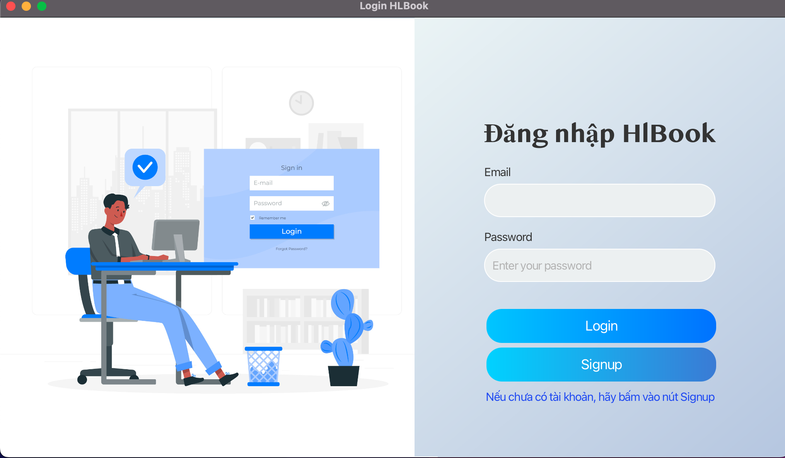
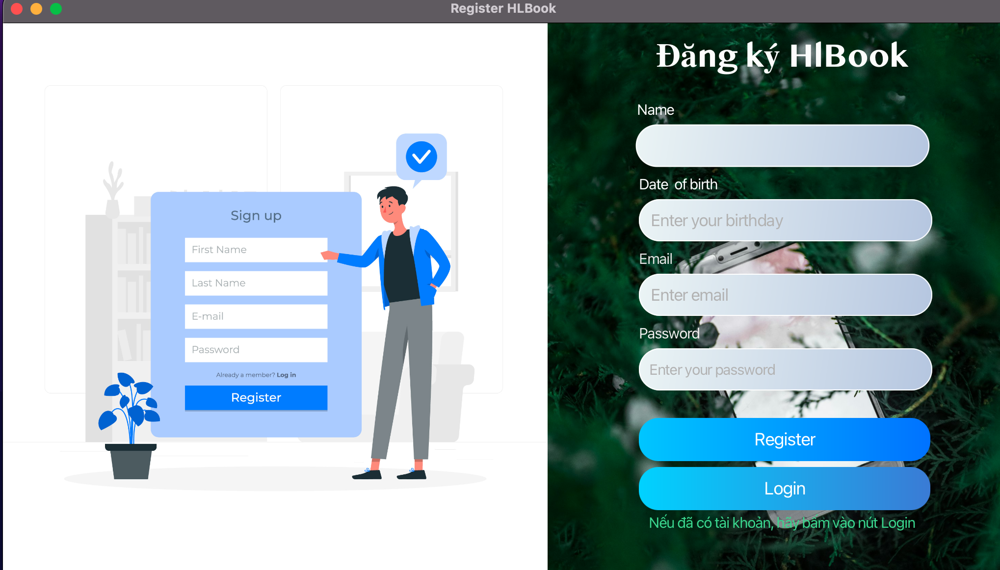
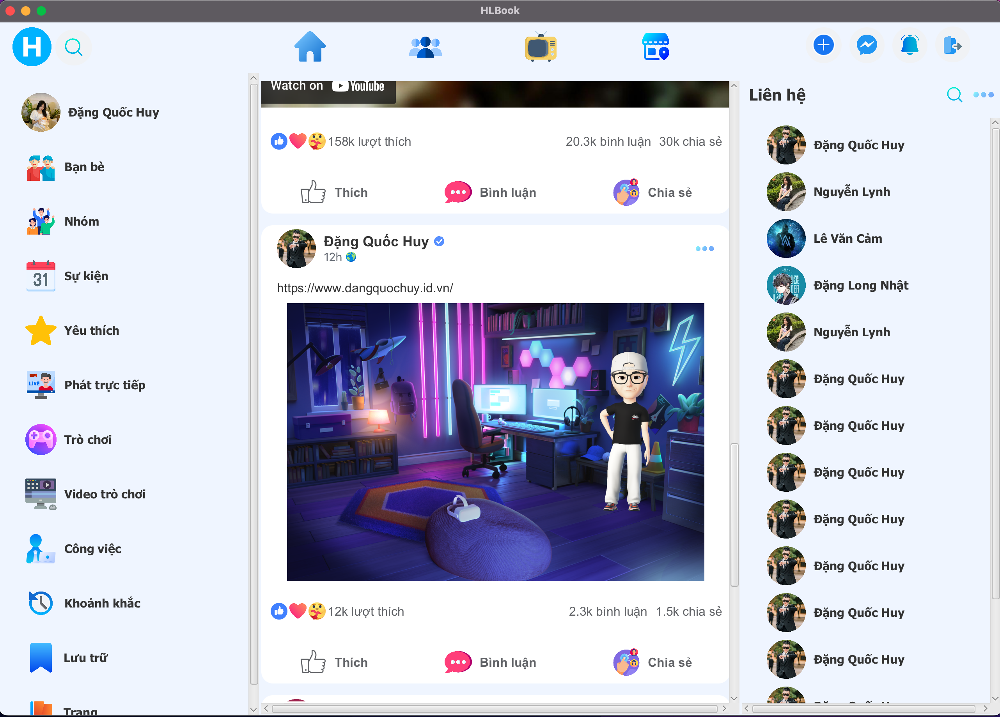
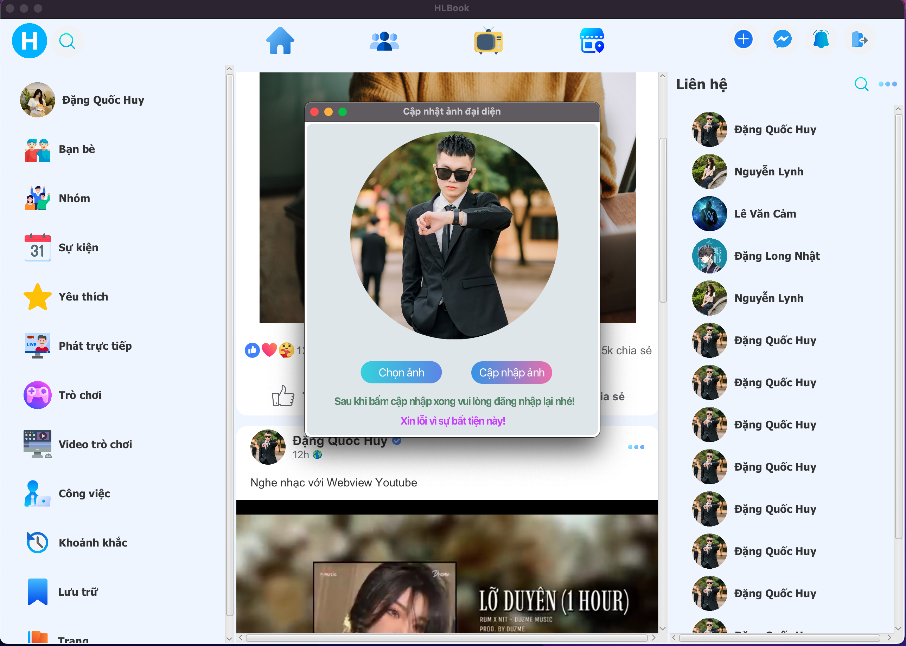
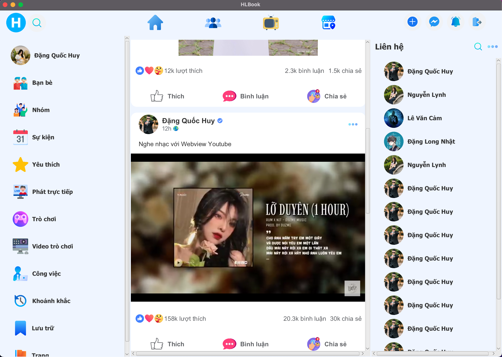

# HlBook - A simple Social Network

HlBook is a simple social networking application inspired by design from the Facebook social network. Developed using Javafx, CSS,... technologies and a bit more about APIs. It allows users to post, edit avatars, watch Youtube, listen to music,...

## Features

- **Post:** Post with only content.
- **Post articles with images:** You can post articles with content and images.
- **Update avatar:** Allows users to choose an arbitrary avatar to update instead of the default avatar.
- **Listen to music, watch Youtube:** WebView's application allows users to watch videos, listen to music with YouTube,...
- **User-Friendly Interface:** Enjoy a visually appealing and intuitive user interface built with JavaFX and CSS.

## Demo

### Login Scene

#### Login

#### Register Account

### Home Scene

#### Home 

### Update Avatar

### Listen to Music

## Technologies Used

HlBook is built using the following technologies:

- **JavaFX:** A platform for creating desktop applications with rich graphical user interfaces.
- **CSS:** Cascading Style Sheets for styling the user interface.

## License

HlBook is licensed under the [danieldev23](danieldev23).
